# Azure Data Factory: Simple Blob to Blob Copy Pipeline

This project demonstrates a fundamental ETL (Extract, Transform, Load) process using **Azure Data Factory (ADF)**. It walks through creating a simple pipeline that copies a file from a `landing` container to a `raw` container within the same Azure Blob Storage account.

---

## What is Azure Data Factory?

 **Azure Data Factory (ADF)** is a cloud-based data integration service that allows you to create, schedule, and manage data workflows .  Think of it as a factory assembly line for your data .  It orchestrates the process of moving raw data from various sources, transforming it into a usable format, and loading it into a destination system for analysis and use .

###  Key Components of ADF  
* **Pipelines**: The logical grouping of activities that together perform a task.  It's the overall workflow .
*  **Activities**: The individual processing steps within a pipeline, such as copying data or running a SQL query .
*  **Datasets**: Pointers or references to the data you want to use in your activities, whether as an input or an output .
*  **Linked Services**: The connection strings that define the connection information needed for ADF to connect to external resources .
*  **Triggers**: These execute a pipeline run, which can be based on a schedule or an event .

---

## Step-by-Step : Copying a File

This tutorial will guide you through using the ADF Copy Data tool to move a file.

### Step 1: Prepare the Storage Containers

First, set up the necessary containers in your Azure Blob Storage account. created three containers to represent different stages of a data pipeline: `landing`, `raw`, and `cleansing`.
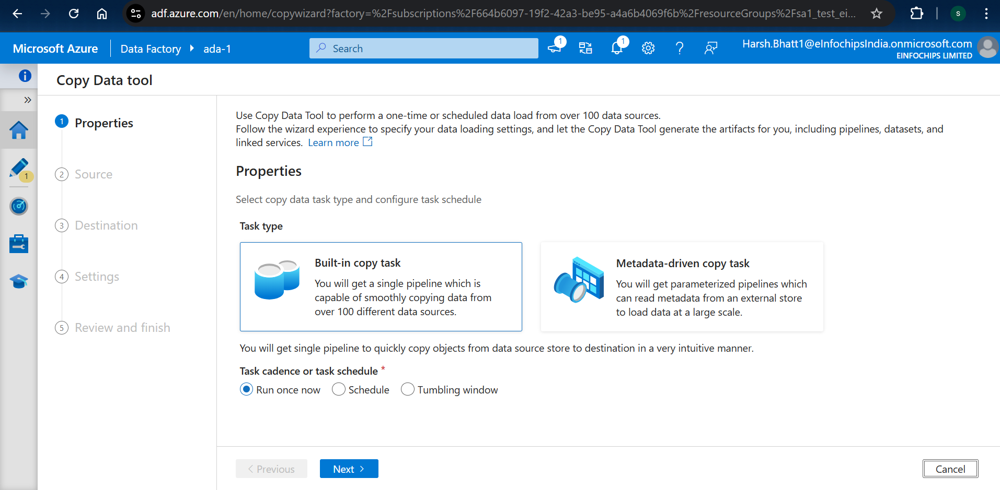

### Step 2: Upload the Source Data

 Upload the file you want to process into the `landing` container . In this example, i have uploaded `aravindsuriADFTutorialmainsampledata.zip`.
 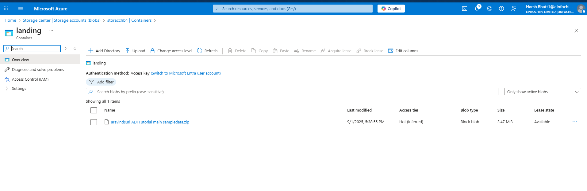

### Step 3: Launch the ADF Copy Data Tool

In your Azure Data Factory workspace, select the **Copy Data tool**.  This provides a user-friendly wizard to quickly create a copy pipeline .
*  **Task type**: Choose **Built-in copy task** .
*  **Task cadence**: Select **Run once now** .
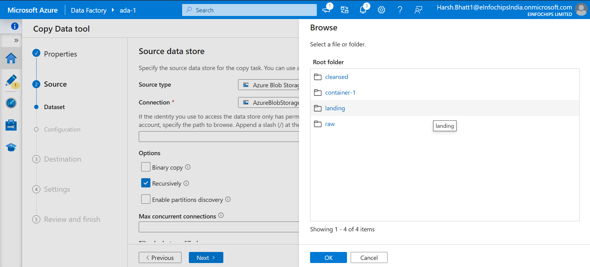

### Step 4: Configure the Source

Specify where the data is coming from.
* **Source type**: Select `Azure Blob Storage`.
* **Connection**: Choose the Linked Service for your storage account.
* **File or folder**: Browse and select the `landing` container as the source.
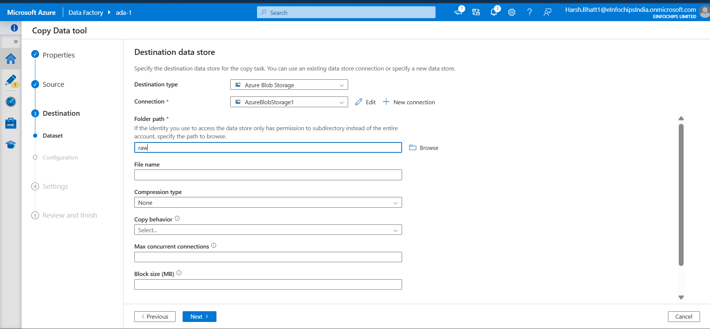
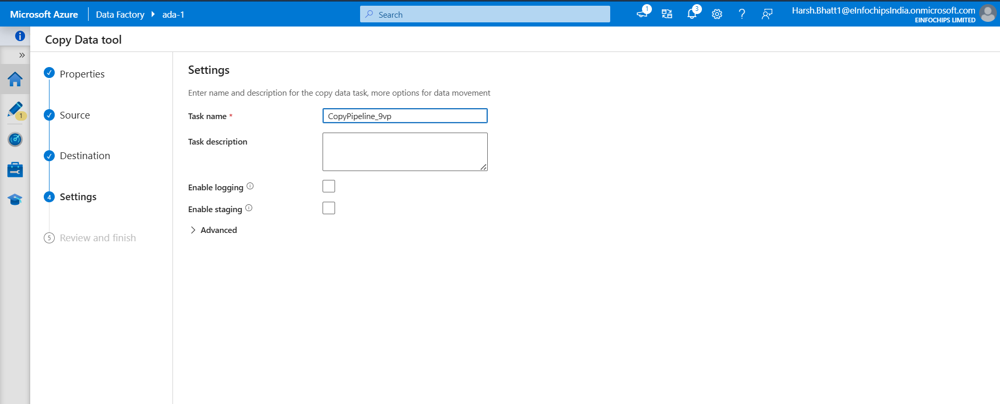

### Step 5: Configure the Destination

Now, specify where the data should be copied to.
*  **Destination type**: Select `Azure Blob Storage` .
*  **Connection**: Use the same Linked Service as the source .
*  **Folder path**: Browse and select the `raw` container as the destination folder .
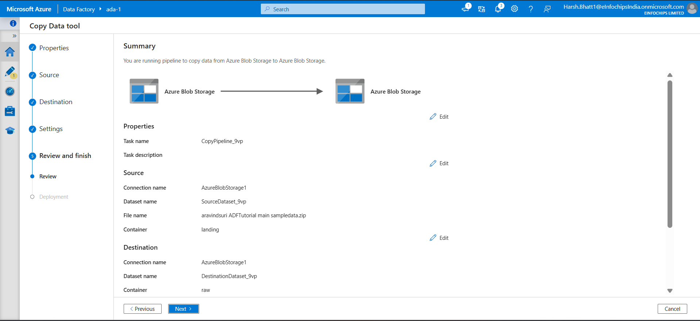

### Step 6: Verify the Result

After the pipeline runs successfully, navigate to your Azure Blob Storage account and open the `raw` container. You should see that the source file has been successfully copied to this destination.

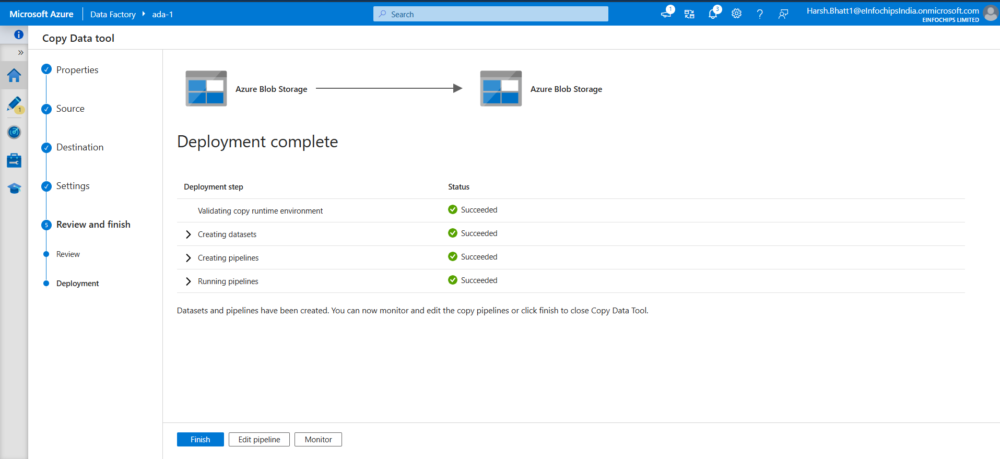
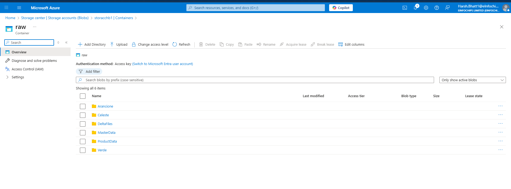

# Azure Data Factory: Metadata-Driven ETL Pipeline with Data Transformations

## Step-by-Step: Metadata-Driven ETL Pipeline

This tutorial guides you through creating a pipeline in Azure Data Factory to retrieve metadata, transform data using a dataflow, and copy the transformed data to a destination in Azure Blob Storage.

### Step 1: Retrieve Metadata

Use the **Get Metadata Activity** to retrieve metadata for all files in a specified folder in Azure Blob Storage.
- **Activity**: Create a pipeline and add a **Get Metadata** activity to fetch details (e.g., file names, sizes) of files in the source folder.
- **Output**: The metadata is used to iterate over files in subsequent steps.
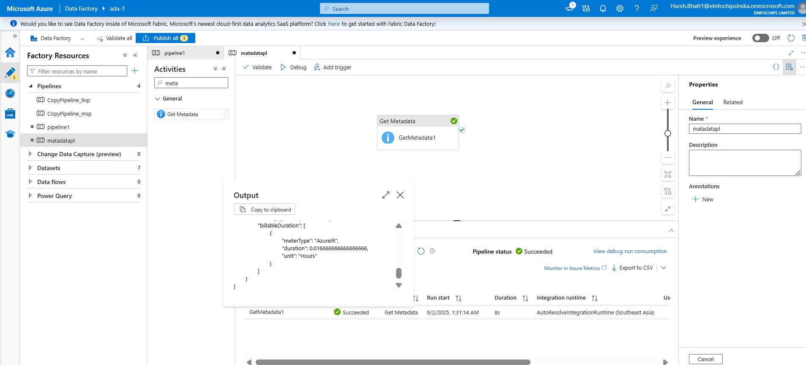

### Step 2: Iterate Over Files with ForEach Loop

Use a **ForEach** activity to iterate through the files identified by the Get Metadata activity.
- **Condition**: Add an **If Condition** activity inside the ForEach loop to apply specific logic (e.g., process files based on a pattern).
- **Dynamic Processing**: Use a parameterized dataset to dynamically handle files as variables during iteration.
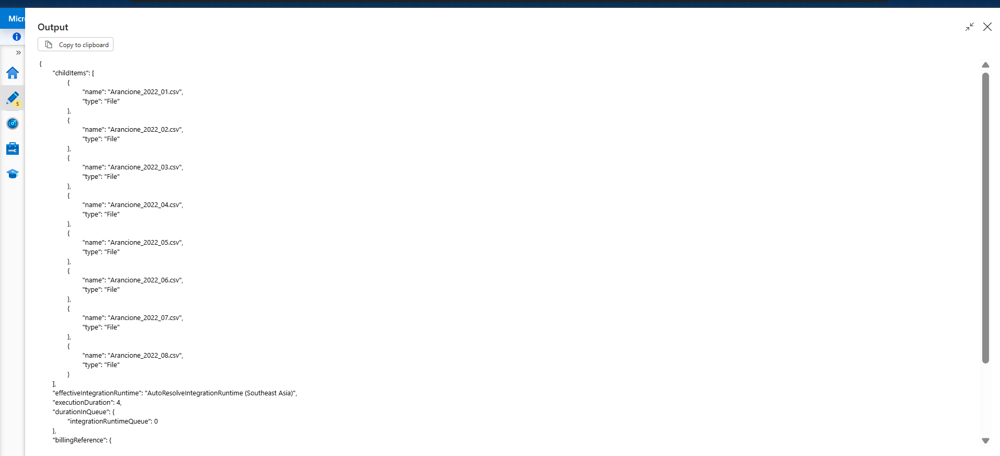
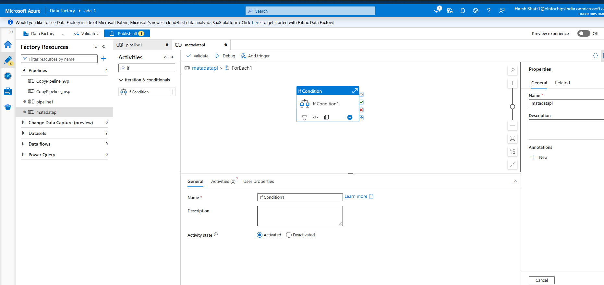

### Step 3: Configure the Source Dataset

Set up the source dataset to read data from the source folder.
- **Source Type**: Azure Blob Storage.
- **Connection**: Use a Linked Service to connect to the storage account.
- **File Path**: Reference the folder containing the source files (e.g., `landing` container).
- **Parameterized Dataset**: Configure the dataset to dynamically point to files based on the metadata retrieved.
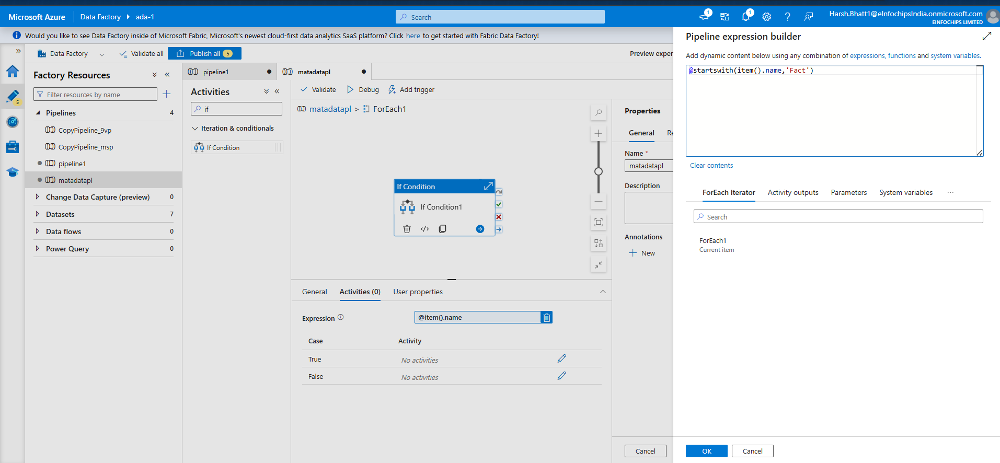
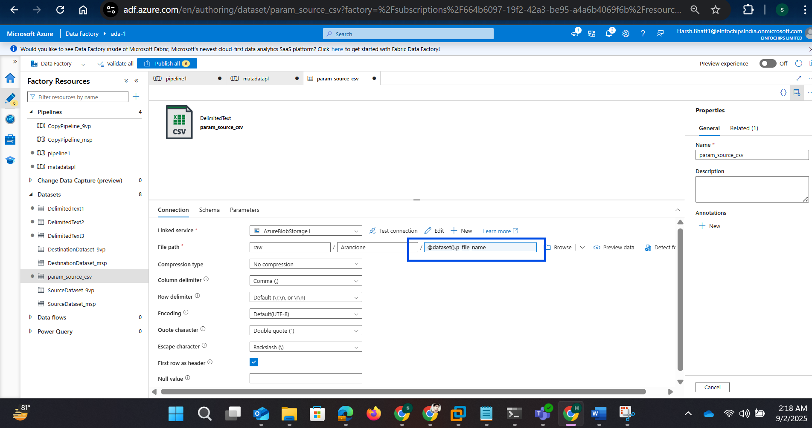

### Step 4: Create a Dataflow for Transformations

Create a **Dataflow** to transform the source data before copying it to the destination.
- **Source Data**: Import data from the source dataset, which contains 8 fields.
- **Select Transformation**:
  - Remove 3 fields from the dataset.
  - Change the data type of the `Quantity` column from string to integer.
  - 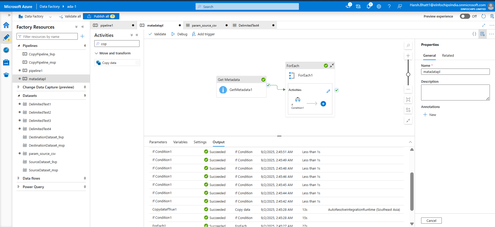
- **Filter Transformation**:
  - Apply a filter condition to include only rows where `Quantity == 13`.
  - 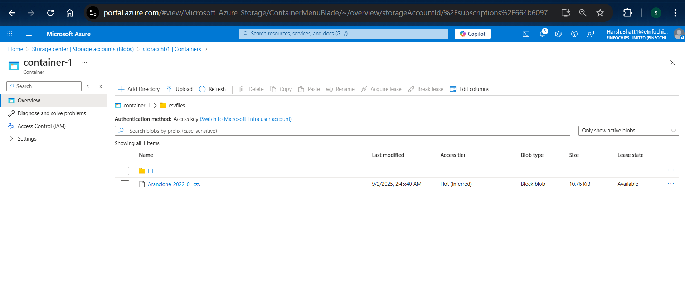
- **Aggregate Transformation**:
  - Group data by specified fields.
  - Perform arithmetic operations like `MIN` and `MAX` on selected fields.
  - 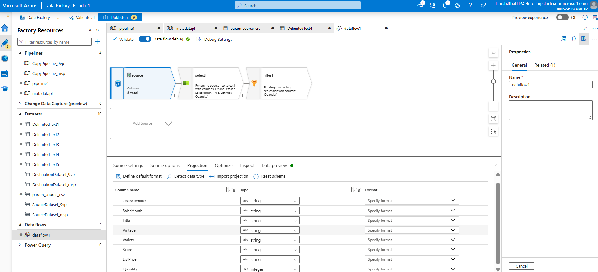

### Step 5: Configure the Destination

Specify the destination for the transformed data.
- **Destination Type**: Azure Blob Storage.
- **Connection**: Use the same Linked Service as the source.
- **Folder Path**: Select the destination folder (e.g., `raw` or `cleansing` container).
- **Copy Activity**: Copy the transformed data to the destination based on the defined pattern.
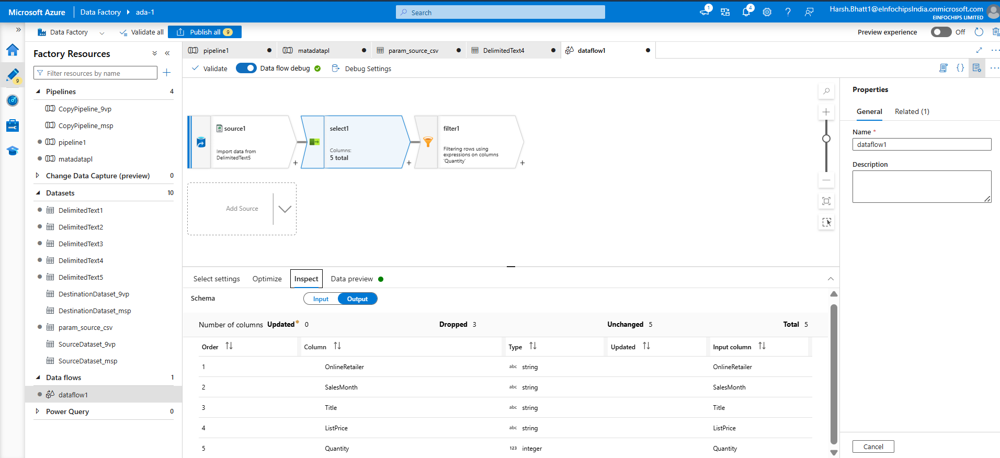
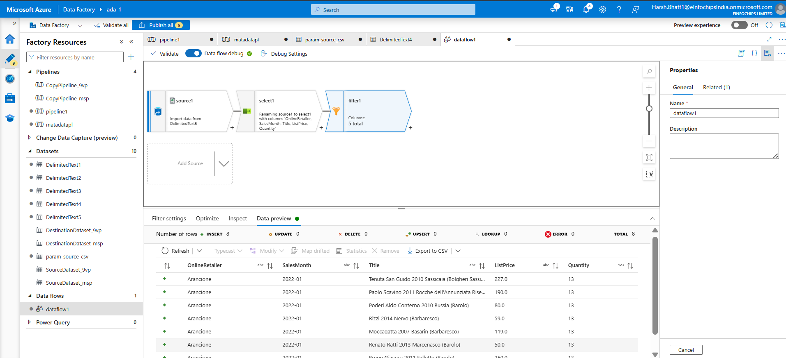

### Step 6: Schedule the Pipeline with a Trigger

Set up a **Trigger** to automate pipeline execution.
- **Trigger Type**: Use a **Storage Event Trigger** to run the pipeline when new files are added to the source folder.
- **Scheduling**: Alternatively, configure a scheduled trigger to run the pipeline at specific intervals.
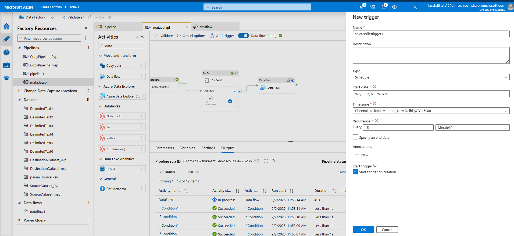
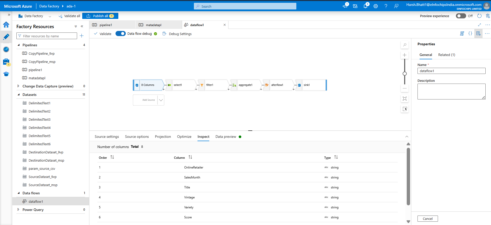

### Step 7: Execute the Pipeline

Run the pipeline to process the data.
- **Pipeline Execution**: Use the **Execute Pipeline** activity to trigger the pipeline manually or via the configured trigger.
- **Status**: Verify that the pipeline runs successfully.
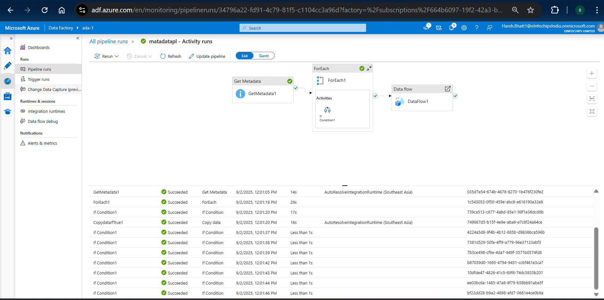
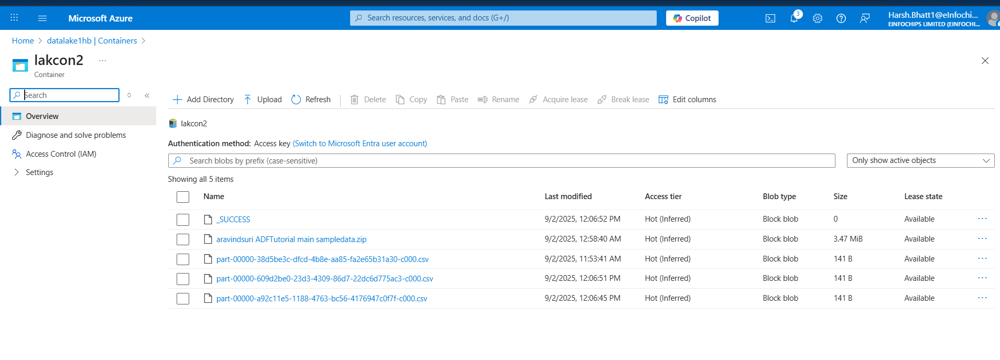

### Step 8: Verify the Output

Check the destination folder in Azure Blob Storage (e.g., `raw` or `cleansing` container) to confirm that the filtered and transformed data has been successfully transferred.
- **Output**: The transformed data is stored in the data lake as per the specified pattern.
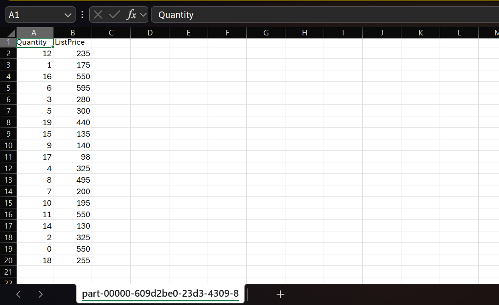
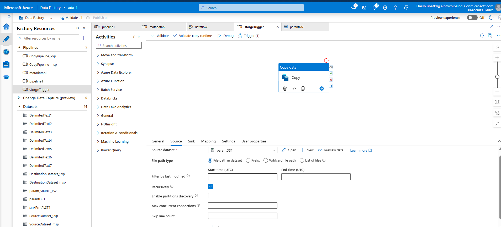

### Step 9: Monitor and Validate

Monitor the pipeline run to ensure all activities (metadata retrieval, dataflow transformations, and copy) completed successfully.
- **Validation**: Check the output data in the destination folder to verify the transformations (e.g., removed fields, filtered rows, aggregated results).
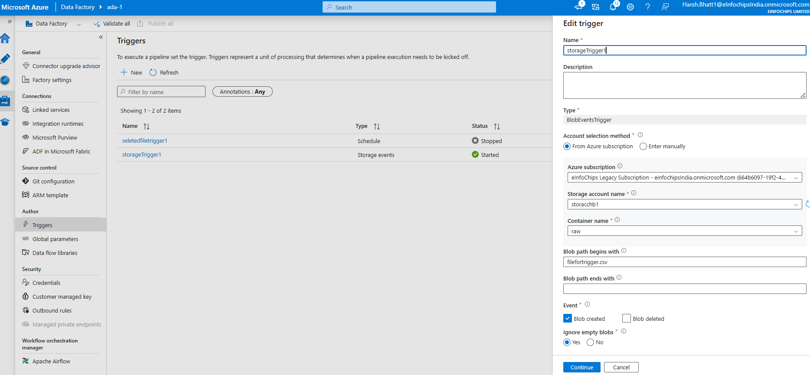
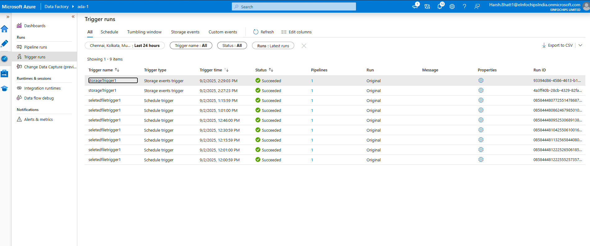

## Results

- The pipeline successfully retrieves metadata for files in the source folder.
- Files are processed dynamically using a parameterized dataset and ForEach loop.
- Data transformations (select, filter, aggregate) are applied using a dataflow.
- The transformed data is copied to the destination folder in Azure Blob Storage.
- The pipeline is triggered automatically via a storage event or scheduled trigger.
- The output in the data lake reflects the filtered and transformed data.