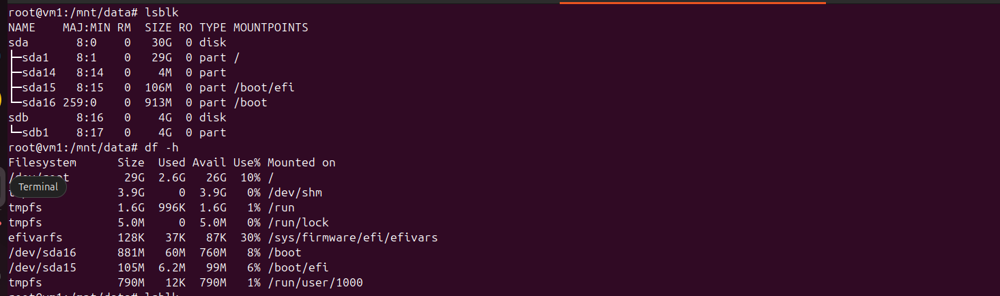
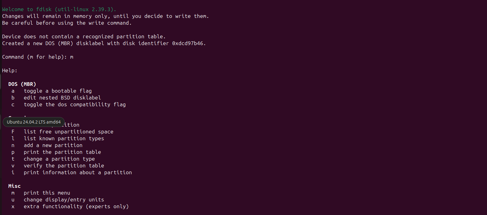
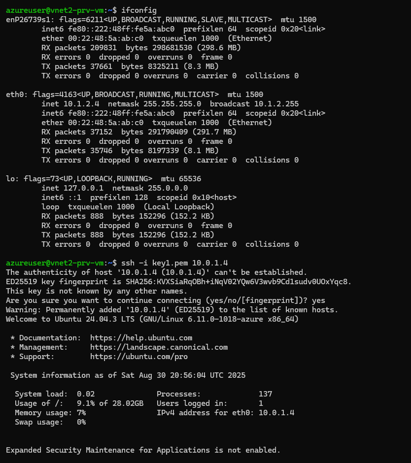
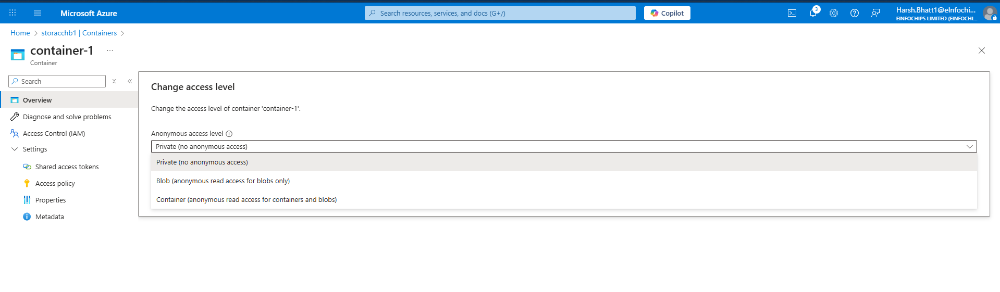

# Azure Practical  

This document contains hands-on tasks performed on Azure Virtual Machines, along with the related concepts learned.  

---

## 1. Creating an Azure VM  

- **Task:** Created an **Azure VM** and logged into the server using **SSH**.  
- **Concept Learned:** A VM is a virtualized compute resource in Azure. You can access it via SSH (Linux) or RDP (Windows).  

  
  

---

## 2. Installing and Accessing Nginx  

- **Task:** Installed **Nginx** and accessed it on **port 80** in the browser using the public IP.  
- **Concept Learned:** Demonstrates hosting a basic web server on Azure and accessing it via public IP + security rules.  

  

---

## 3. Attaching and Mounting an Additional Volume  

- **Task:** Attached an additional volume to **VM1** and mounted it on Ubuntu to access storage.  
- **Concept Learned:** Azure Disks provide persistent storage. Volumes can be attached/detached and mounted for expansion.  

  
  
  
  
  

---

## 4. Creating a Snapshot and Restoring Data  

- **Task:**  
  - Created a **snapshot** of the extra volume attached to **VM1**.  
  - Created a **new volume** from that snapshot.  
  - Attached the new volume to another VM (**VM2**).  
  - Verified that **data created in VM1 was accessible in VM2**.  
- **Concept Learned:** Snapshots provide point-in-time backup of disks, which can be used to create new volumes or restore data.  

  
  
  
  

---

## 5. Creating and Using VM Images  

- **Task:** Created a **standard image** from **VM1** and used it to create other VMs with:  
  - **Custom script**  
  - **Placement Group**  

- **Concept Learned:**  
  - **Generalized VM Image** → Reusable, requires hostname/user reconfiguration. Useful for team-wide templates (e.g., with Java preinstalled).  
  - **Specialized VM Image** → Exact replica of a VM (apps, hostname, and credentials intact). Useful for cloning environments.  

  
 

---

## 6. Availability Options in Azure  

### Proximity Placement Group (PPG)  

- **Concept Learned:** Keeps VMs physically close within the same datacenter → useful for **low-latency applications** like trading, analytics, or database+app workloads.  

---

### Availability Set  

- **Concept Learned:** Ensures **high availability** by spreading VMs across **fault domains** (racks/power/network paths) and **update domains** (maintenance groups). Prevents all VMs from failing at once.  
- **Use Case Example:** Multiple web servers in an availability set ensure one stays up during maintenance or failure.  

---

# Azure vs AWS – Public IPs, Private Subnets, and NAT Gateways

This document explains how **Azure** and **AWS** handle Public IPs and outbound Internet access for VMs/EC2 instances inside private subnets.

---

## Azure

- When you create a VM, you can **choose to assign a Public IP**, even if the VM is in a “private subnet.”
- **If a Public IP is assigned:**
  - Outbound Internet access works directly through that Public IP (no NAT Gateway needed).
  - Inbound traffic from the Internet is possible (if NSG/firewall allows).
- **If no Public IP is assigned:**
  - Outbound traffic still works by default.
  - Azure provides a **system route** → `0.0.0.0/0 → Internet`.
  - Azure uses **default SNAT** behind the scenes with shared Azure IPs.
  - This is fine for light traffic, but not scalable or controllable.

For production:
- Use a **NAT Gateway** so outbound traffic:
  - Has a **predictable Public IP** (your NAT Gateway’s IP).
  - Avoids **SNAT port exhaustion issues**.

---

## AWS

- If an instance is in a **private subnet**:
  - It **cannot** be assigned a Public IP (by design).
- To enable **outbound Internet**:
  - You must use a **NAT Gateway**.
- To allow **inbound Internet traffic**:
  - Place the instance in a **public subnet** and attach a Public IP.

---

##  Summary

- **Azure** is more flexible:  
  - You can assign a Public IP to a VM even in a private subnet.  
- **AWS** is stricter:  
  - Private subnet means **no Public IP**.  

### Best Practice (for both Azure & AWS):
- Use **Private Subnet + No Public IP + NAT Gateway** for outbound-only Internet access.

---

## 7. Connecting via Bastion
- **Task:** Connected to a VM via **Azure Bastion**, which was in a private subnet without a public IP.  
- **Concept Learned:**  
  Azure Bastion provides secure and seamless RDP/SSH connectivity to VMs directly through the Azure portal — no need for public IPs.  

## 8. VNet Peering and Private SSH Access
- **Task:** Peered two VNets and accessed a VM in another subnet using its **private IP** from the vm in different VNet.  
- **Concept Learned:**  
  VNet peering connects two Azure VNets, enabling traffic between them with low latency and high bandwidth.  

---

## 9. Working with VM Scale Sets (VMSS) and Load Balancer
- **Task:**  
  - Encountered error: *"ApplicationGatewaySubnetCannotBeUsedByOtherResources"*.  
  - Fixed it by creating a NIC in a different subnet.  
  - Created a VMSS and an Application Load Balancer.  
  - Installed Nginx on one VM and accessed it through the Load Balancer.  

- **Concept Learned:**  
  - A subnet used by Application Gateway cannot host other resources.  
  - VM Scale Sets allow autoscaling of VMs.  
  - Load Balancer distributes traffic across VMs.  

## 10. Blob Storage Service
- **Task:**  
  - Created a storage account.  
  
  - Created a container and uploaded a file.  
  
  

  - Enabled anonymous access for public access.  
  

- **Concept Learned:**  
  - **Azure Storage Explorer** provides GUI-based management of Blob, File, Queue, and Table storage.  
  - Blob access levels can be modified for public or restricted use.  

## 11. Azure Storage – Key Concepts
- **Stored Access Policy:** Centrally control SAS token permissions/expiry.  
- **Redundancy Options:**  
  - **LRS:** Cheapest, single datacenter.  
  - **ZRS:** Zone-resilient.  
  - **GRS:** Geo-redundant, cross-region.  
  - **GZRS:** Zone + Geo redundant, mission-critical.  
- **Access Tiers:** Hot (frequent), Cool (infrequent), Cold (rare), Archive (long-term).  
- **Lifecycle Policies:** Automate tiering and cleanup.  
- **File Shares:** SMB/NFS compatible for hybrid lift-and-shift. 

## 12. Manage Azure Identities and Governance

Azure's identity and governance system is centered around **Microsoft Entra ID** (formerly Azure AD), which is like a supercharged IAM service.  
The end goal is the same as AWS: **control who/what can do what to resources.**  

**Key difference from AWS:**  
- **AWS:** More *flat* → attach policies directly to users/groups/roles.  
- **Azure:** More *hierarchical* → assign roles at different scopes and use policies for compliance. Multiple subscriptions allow segmenting billing/environments (e.g., dev vs prod), which isn't as baked into AWS accounts.  

---

### 1. Identities (Who or What Gets Access?)
- **Users** → Individual accounts (like AWS users). Created in Entra ID, can be synced from on-prem AD or external (e.g., Microsoft accounts).  
- **Groups** → Collections of users (like AWS groups). Use for bulk access—e.g., "DevTeam" group.  
- **Service Principals / App Registrations** → For apps/services (like AWS service roles). Not for humans—e.g., an app needs to access a database.  
- **Managed Identities** → Azure’s auto-managed version of service principals (no AWS direct equivalent).  
  - **System-assigned:** Tied to a resource.  
  - **User-assigned:** Reusable across resources.  
  - No passwords—Azure handles auth.  

  **Think:** Define the *who*—humans, teams, or machines/apps. Similar to AWS, but Managed Identities make app auth easier and more secure.  

### 2. Access Management / Permissions (What Can They Do?)
- **Role-Based Access Control (RBAC):** Built-in or custom roles (like AWS policies, but role-focused).  
  - Examples: "Reader" = view only, "Contributor" = create/edit.  
- **Role Assignments:** Attach a role to an identity (user/group/principal) **at a scope**.  
  - **Scopes:**  
    - **Subscription** → broad.  
    - **Resource Group** → mid-level.  
    - **Resource** → narrow.  
- **Permissions:** Granular actions (e.g., `"Microsoft.Storage/storageAccounts/write"`).  
  - Roles bundle these—e.g., assign **Storage Blob Data Contributor** to let someone upload blobs.  

  **Think:** Grant access surgically. In AWS, you'd attach a policy to a role/user; in Azure, you assign a role to an identity at a scope.  

### 3. Logical Grouping / Hierarchy (Where Does Access Apply?)
- **Management Groups:** Top-level containers for organizing subscriptions (no direct AWS equivalent). Apply policies/RBAC once, cascades down.  
- **Subscriptions:** Like mini-accounts. Each has billing/quotas (e.g., one for HR, one for IT). Multiple subs per tenant.  
- **Resource Groups:** Logical buckets for related resources. Deploy/manage/delete as a unit. Access/Policies apply here.  

  **Think:** Organize chaos.  
Azure hierarchy = **Management Group > Subscription > Resource Group > Resource**.  
AWS relies more on **tags/folders** in Organizations.  

### 4. Governance / Compliance (Enforce Rules Automatically)
- **Azure Policy:** JSON-based rules (like AWS Config/SCP). Enforce standards—e.g.,  
  - "All VMs must be in Europe."  
  - "Deny public blobs."  
- **Initiatives (formerly Blueprints):** Groups of policies (like AWS policy sets). For reusable compliance packs (e.g., PCI-DSS baseline).  
- **Resource Locks:** Prevent accidental deletes/changes (e.g., `CanNotDelete` lock on a critical DB).  
- **Azure Advisor / Cost Management:** Recommendations & budgeting tools for governance + optimization.  

  **Think:** Automate oversight. AWS has SCP/Organizations, but Azure Policy is more flexible for auditing + fixing issues.  

### 5. Advanced / Integration Features
- **Conditional Access:** Entra ID feature for MFA, location-based rules (like AWS MFA, but more dynamic).  
- **Privileged Identity Management (PIM):** Just-in-time access (temporary role elevation; AWS has no built-in equivalent).  
- **Microsoft Defender for Cloud:** Security governance layer (integrates with IAM for threat detection).  

  **Think:** Extra layers for enterprise. These extend basics for **zero-trust** and complex governance needs.  

###   Final Consulting Style Summary
- **Identities** = Who or what gets access.  
- **RBAC & Role Assignments** = What they can do.  
- **Hierarchy (Mgmt Groups → Subs → RGs → Resources)** = Where access applies.  
- **Governance (Policies, Initiatives, Locks, Advisor)** = Enforce compliance & prevent mistakes.  
- **Advanced Features (PIM, Conditional Access, Defender)** = Enterprise-grade security & zero-trust.  

---

## 13. Azure Monitoring Services
- **Data Collection:** Metrics (performance), Logs (detailed), Activity Logs (audit), Change Tracking.  
- **Alerts & Automation:** Alerts, Action Groups, Autoscale.  
- **Security Monitoring:** Defender for Cloud (posture), Sentinel (SIEM), Compliance reports. 

- **Metrics**

- **Alerts**

- **•Alert notification**

## 14. Azure Backups
- **Task:** Configured backup for Azure VMs and storage.  
- **Concept Learned:**  

  **Backup Scopes:** VMs, Databases (SQL, SAP HANA), Files, On-prem servers.  
  **Backup Types:** Full, Incremental, Differential/Log.  
  **Vaults:** Recovery Services Vaults (modern, recommended).  
  **Policies:** Define schedule + retention.  
  **Redundancy:** LRS, ZRS, GRS (default), GZRS.  
  **Security:** Encryption, Soft delete, Immutable vaults, Private endpoints. 

## 15. Azure Resource Manager (ARM)

Azure Resource Manager (**ARM**) is Azure’s **deployment and management layer**.  
It controls how resources are created, updated, and deleted.

### Key Points
- **Resource Providers:** Services like `Microsoft.Compute`, `Microsoft.Storage`.  
- **Resources & RGs:** Resources live inside **Resource Groups** (logical containers).  
- **ARM Templates:** JSON files for Infrastructure as Code (idempotent, reusable).  
- **Scopes:** Management Group → Subscription → Resource Group → Resource.  
- **Benefits:** Consistency, automation, governance (RBAC + Policy), tagging. 

